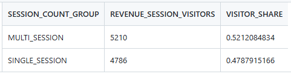
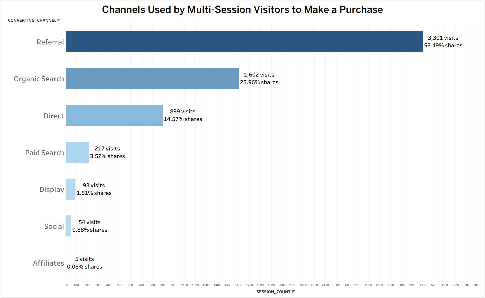
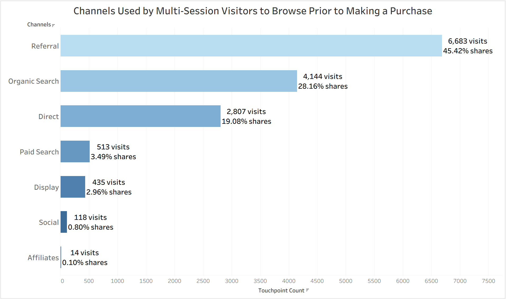
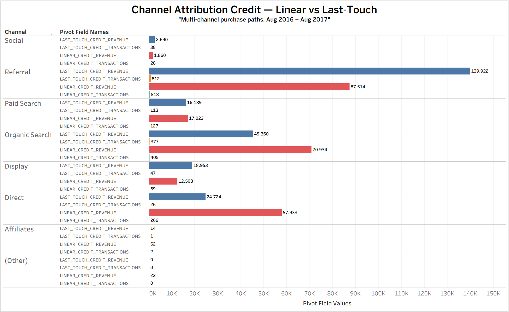

WIP : August 24 2026
# Google Merchandise Store — Purchase-Path & Channel Attribution Analysis

**Multi-Session Purchase Behavior, Converting-Channel Frequency, Prior-Touchpoint Channels, and Last-Touch vs. Linear Attribution Credit**
  

- Independent portfolio analysis using obfuscated Google Analytics 360 sample data from the Google Merchandise Store, accessed through BigQuery Public Datasets.
- Developed under the working codename **"Dashvio"** — SQL comments and internal notes from development may still reference that name.
- This is an End-to-end purchase-path and channel attribution project analyzing the public Google Analytics 360 sample dataset from the Google Merchandise Store (Aug 2016–Aug 2017).

  

➤ **Project Purpose :** 

This project analyzes how purchasing visitors on the Google Merchandise Store reach a transaction, and how credit for that transaction splits across marketing channels under two attribution models. It uses the public GA360 e-commerce dataset (Aug 2016–Aug 2017), accessed via BigQuery Public Datasets and rebuilt in Snowflake.

  

➤ **Dataset & Structure Overview :** 

An **attribution project** on this dataset has one thing to note before any SQL gets written: the dataset only covers twelve months. A visitor's earliest session inside that window is not necessarily their first-ever visit to the store — the window is left-censored. Because the dataset begins in August 2016, it cannot identify a visitor's true first-ever touch. A first-touch model could only be described as first observed touch within the available period — which is a different, weaker claim than true first-touch attribution.

Dashvio works through three connected layers built on GA360's session-grain data :
- **STG_SESSIONS**, one row per session, and
- **STG_HITS**, one row per hit — not yet used, since every question here operates at session grain.

**BQ01** sits at the purchase-behavior layer — how many sessions it took a visitor to reach a purchase in the first place.  
**BQ02** sits at the channel layer — where those purchase paths actually go, both at the closing session and in the sessions leading up to it.  
**BQ03** sits at the attribution layer — once a path is built, how the credit for that purchase splits across the channels in it, under two different allocation rules.  

**BQ02** depends on **BQ01**: both **BQ02A** and **BQ02B** filter to visitors **BQ01A** already labeled MULTI_SESSION before doing anything else. **BQ03** is built independently, straight from **STG_SESSIONS** — it doesn't read **BQ01** or **BQ02**'s output — but it answers the same kind of question at a finer grain: not just which channel closes a purchase, but how credit for that purchase splits across every channel in the path.

Each table states its grain. Every filter has a reason a business reader can trace back to the question it answers.

  

➤ **Skills Demonstrated:**

(SQL • Snowflake • Purchase-Path Construction • Window Functions (ROW_NUMBER, LAG) • Multi-Touch Attribution • CTE Pipeline Design • Revenue Conservation Validation • Scope-Honest Analytical Framing)
  

## Raw Data

The complete raw export is not stored in this repository because it exceeds
GitHub's file-size limits.

Source:
`bigquery-public-data.google_analytics_sample.ga_sessions_*`

Date range:
2016-08-01 through 2017-08-01

This is a public Google Analytics 360 sample dataset from the Google
Merchandise Store. The SQL used to select, transform, and validate the data is
included in this repository. Small analytical outputs and a sample of the
session data are included for inspection.

  

## Core Business Questions :

**PURCHASE BEHAVIOR**  
**BQ01** — What share of purchasing visitors converted in a single session vs. multiple sessions?
 

**CHANNEL & TOUCHPOINT ANALYSIS**  
**BQ02A** — Which channels do multi-session visitors purchase through? 
**BQ02B** — Which channels do multi-session visitors touch before they make a purchase, and how often?
 

**ATTRIBUTION ANALYTICS**  
**BQ03** — Under last-touch and linear attribution, how much transaction and revenue credit does each channel receive?
 

---

 

## The Main Report - Key Questions Answered

 

### BQ01 - What share of purchasing visitors converted in a single session vs multiple sessions ?
  
Query logic:

  <b>
    <a href="SQL/BQ01A_VISITOR_SESSION_COUNT_LABELED.sql">
      BQ01A_VISITOR_SESSION_COUNT_LABELED.sql
    </a>
  </b>

Find each visitor's earliest observed revenue session, then count every session from their first observed session up to and including that revenue session

  

  <b>
    <a href="SQL/BQ01B_SINGLE_VS_MULTI_SESSION_SUMMARY.sql">
      BQ01B_SINGLE_VS_MULTI_SESSION_SUMMARY.sql 
    </a>
  </b>

Group visitors by SINGLE_SESSION or MULTI_SESSION and calculate each group's share of all purchasing visitors

  

  <b>
    <a href="Data_Generated/BQ01B_SINGLE_VS_MULTI_SESSION_SUMMARY.csv">
      Download CSV: BQ01B Single vs. Multi-Session Summary
    </a>
  </b>

  

  

 

**Key Insights**
- Multi  -session: 52.1% of purchasing visitors (5,210 people) browsed at least once before buying.
- Single -session: 47.9% of purchasing visitors (4,786 people) bought on their first visit, no prior browsing.
- The split is close, about 4 points apart, with slightly more visitors needing more than one visit to buy.

 

**Notes**
- A visitor labeled single-session can still buy again later. BQ01 only tracks the path to their first purchase, not what happens after.
- "First observed session" isn't a visitor's true first-ever visit. The dataset only covers 12 months, so someone who first browsed before August 2016 still shows up here as if their history started later than it really did.

  

---

### BQ02A - Which channels do multi-session visitors purchase through?

  

Query logic:

  <b>
    <a href="SQL/BQ02A_MULTI_SESSION_CONVERTING_CHANNEL.sql">
      BQ02A_MULTI_SESSION_CONVERTING_CHANNEL.sql
    </a>
  </b>

Keep visitors labeled MULTI_SESSION from BQ01A, join them to their revenue session, and count revenue sessions by channel
  

**Chart**

  

  <b>
    <a href="Data_Generated/BQ02A_MULTI_SESSION_CONVERTING_CHANNEL.csv">
      Download CSV: BQ02A Multi-Session Converting Channel
    </a>
  </b>

 

**Key Insights**
- 6,171 observed revenue visits belong to multi-session visitors.
- Referral's purchase-visit count (3,301) is more than the other six channels' purchase-visit counts combined (2,870).

  

### BQ02B - Which channels do multi-session visitors touch before they make a purchase, and how often?

 

Query logic:

  <b>
    <a href="SQL/BQ02B_PRIOR_TOUCHPOINT_CHANNEL_SUMMARY.sql">
      BQ02B_PRIOR_TOUCHPOINT_CHANNEL_SUMMARY.sql
    </a>
  </b>

For each multi-session purchase, look back at the sessions between it and the visitor's previous purchase (or the start of their observed history, for a first purchase), then count those prior sessions by channel

  

**Chart**

  

  <b>
    <a href="Data_Generated/BQ02B_MULTI_SESSION_PRIOR_TOUCHPOINTS_SUMMARY.csv">
      Download CSV: BQ02B Prior Touchpoint Channel Summary
    </a>
  </b>

 

**Key Insights**
- 14,714 prior browse visits happen before multi-session purchases.
- Referral's prior-browse count (6,683) is less than the other six channels' prior-browse counts combined (8,031).

 

---

### BQ03 - Under last-touch and linear attribution, how much transaction and revenue credit does each channel receive?

 

Query logic:

  <b>
    <a href="SQL/BQ03A_PURCHASE_PATHS.sql">
      BQ03A_PURCHASE_PATHS.sql 
    </a>
  </b>

For every purchase a visitor made, assemble the sessions that belong to that purchase's path: from the visitor's previous purchase (or the start of their observed history) up to and including the current purchase
  

  <b>
    <a href="SQL/BQ03B_PATH_CREDIT_ASSIGNED.sql">
      BQ03B_PATH_CREDIT_ASSIGNED.sql 
    </a>
  </b>

Drop paths that touched only one distinct channel, since last-touch and linear are forced to agree on those. On the paths that remain, assign linear credit (an equal share of the purchase to every session in the path) and last-touch credit (the full purchase to the closing session, zero to the rest)
  

  <b>
    <a href="SQL/BQ03C_CHANNEL_ATTRIBUTION_CREDIT.sql">
      BQ03C_CHANNEL_ATTRIBUTION_CREDIT.sql
    </a>
  </b>

Sum both credit types by channel
  

**Chart**

  

  <b>
    <a href="Data_Generated/BQ03C_CHANNEL_ATTRIBUTION_CREDIT.csv">
      Download CSV: BQ03C Channel Attribution Credit
    </a>
  </b>

 

**Key Insights**
- Referral, Organic Search, and Direct rank first, second, and third under both models, and are the three channels whose credited revenue changes materially depending on which model is applied.
  - Referral        : $87,514 linear, $139,922 last-touch
  - Organic Search  : $70,934 linear, $45,360 last-touch
  - Direct          : $57,933 linear, $24,724 last-touch
- Paid Search and Display trade fourth and fifth place depending on the model. Paid Search is fourth under linear ($17,023 vs $12,503); Display is fourth under last-touch ($18,953 vs $16,189).
- Social, Affiliates, and (Other) are negligible under both models, none exceeding $2,700.
- Credit totals cover multi-channel purchase paths only, observed between 2016-08-01 and 2017-08-01. Single-channel paths were removed in BQ03B.

 

---

## Conclusion

This project was built to study multi-touch attribution against a real dataset rather than a synthetic one, using the public GA360 sample from the Google Merchandise Store.

BQ01 and BQ02 answer questions about purchase behavior — how many sessions precede a purchase, which channels close purchases, and which channels appear before them. Those questions resolve into facts about how visitors reach a purchase.

BQ03 is a different kind of output. Assigning credit to channels produces a quantity, not a conclusion. Referral holding $87,514 under linear and $139,922 under last-touch describes where each allocation rule places revenue; it does not say which channel deserves more budget. That decision requires channel spend, campaign objectives, and margin — none of which exist in the GA360 dataset, and most of which sit outside an attribution model entirely.

The marketing department would need channel spend, campaign objectives, and margin to decide budget priority. The GA360 dataset contains none of those. BQ03C supplies the credited-revenue figure that a budget decision would use alongside them, and nothing beyond that.

